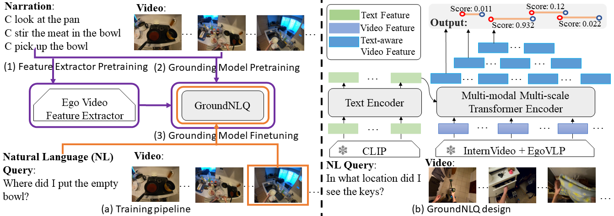

# GroundNLQ @ Ego4D Natural Language Queries Challenge 2023

[Techical report](https://arxiv.org/abs/2306.15255)
> **TL;DR:**  GroundNLQ won the first place at the Ego4D Natural Language Queries Challenge at CVPR23.
Technically, we leverage a two-stage pre-training strategy to train egocentric feature extractors and the grounding model 
on video narrations, and further fine-tune the model on annotated data.
In addition, we introduce a novel grounding model GroundNLQ, which employs a multi-modal multi-scale grounding module 
for effective video and text fusion and various temporal intervals, especially for long videos. 

<div align="center">
  
</div>
This repo supports data pre-processing, training and evaluation of the Ego4D-NLQ dataset. 


## Changelog
* [2024.01.22] We release the **pretrained weights and some checkpoints**.
* [2023.07.08] We release the GroundNLQ codebase.
* [2023.06.19] GroundNLQ model won [**1st place**](https://eval.ai/web/challenges/challenge-page/1629/overview)@ [Ego4D NLQ Challenge 2023](https://ego4d-data.org/workshops/cvpr23/), hosted by CVPR 2023.


## Table of Contents

* [Preparation](#Preparation)
    * [Install dependencies](#Install-dependencies)
    * [Prepare offline data (e.g., features and files)](#Prepare-offline-data)
* [Code Overview](#Code-Overview)
* [Experiments](#Experiments)
  * [Pre-Train](#Pre-training)
  * [From-scratch](#Training-From-Scratch)
  * [Finetune](#Training-Finetune)
  * [Inference](#Inference)
  * [Ensemble](#Ensemble)
* [Contact](#Contact)  
* [Acknowledgement](#Acknowledgements)


##  Preparation

### Install-dependencies 
* Follow [INSTALL.md](./INSTALL.md) for installing necessary dependencies and compiling the code.


### Prepare-offline-data
* We leverage the extracted egocentric InterVideo and EgoVLP features and CLIP textual token features, please refer to [Feature_Extraction_RM](./feature_extraction/README.md).
* Please refer to [File_Precess_RM](./ego4d_data/README.md) and [Narration_Precess_RM](./ego4d_data_narration/README.md).
* Download the Ego4D-NLQ and model data, including files, features, pretrained-weights, checkpoints. (https://drive.google.com/file/d/1tyrVLcs0m0svA6TZpubX_VlpjAvLU18F/view?usp=sharing) (about 10G). 


## Code-Overview
The structure of this code repo is heavily inspired by Detectron2. Some of the main components are
* ./libs/core: Parameter configuration module.
* ./libs/datasets: Data loader and IO module.
* ./libs/modeling: Our main model with all its building blocks.
* ./libs/utils: Utility functions for training, inference, and postprocessing.

##  Experiments
We adopt distributed data parallel [DDP](https://pytorch.org/tutorials/intermediate/ddp_tutorial.html) and 
fault-tolerant distributed training with [torchrun](https://pytorch.org/tutorials/beginner/ddp_series_fault_tolerance.html).

### Pre-training
Training can be launched by running the following command:
```
bash tools/pretrain_ego4d_narration.sh CONFIG_FILE OUTPUT_PATH 
```
where `CONFIG_FILE` is the config file for model/dataset hyperparameter initialization,
`OUTPUT_PATH` is the model output directory name defined by yourself.

The checkpoints and other experiment log files will be written into `ckpt/OUTPUT_PATH`. 
For more configurable options, please check our config file [libs/core/config.py](libs/core/config.py).

The actual command used in the experiments is
```
bash tools/pretrain_ego4d_narration.sh configs/ego4d_narrations_nlq_internvideo.yaml pretrain
```

### Training-From-Scratch
Training can be launched by running the following command:
```
bash tools/train ego4d_finetune_head_twogpu.sh CONFIG_FILE OUTPUT_PATH CUDA_DEVICE_ID
```
where `CUDA_DEVICE_ID` is cuda device id.

The actual command used in the experiments is
```
bash tools/train_ego4d_finetune_head_twogpu.sh configs/ego4d_nlq_v2_internvideo_1e-4.yaml scratch_2gpu 0,1
```

### Training-Finetune
Training can be launched by running the following command:
```
bash tools/train ego4d_finetune_head_onegpu.sh CONFIG_FILE RESUME_PATH OUTPUT_PATH CUDA_DEVICE_ID
```
where `RESUME_PATH` is the path of the pretrained model weights.

The actual command used in the experiments is
```
bash tools/train_ego4d_finetune_head_onegpu.sh configs/ego4d_nlq_v2_pretrain_finetune_internvideo_2.5e-5.yaml \ 
/s1_md0/leiji/v-zhijian/ego4d_nlq_cvpr_2023_data/pretrain_weights/epoch_005.pth.tar finetune_1gpu 0
```
```
bash tools/train_ego4d_finetune_head_onegpu.sh configs/ego4d_nlq_v2_pretrain_finetune_internvideo_2.5e-5_train+val.yaml \ 
/s1_md0/leiji/v-zhijian/ego4d_nlq_cvpr_2023_data/pretrain_weights/epoch_005.pth.tar finetune_1gpu 0
```

### Inference
Once the model is trained, you can use the following commands for inference:
```
bash tools/inference_ego4d_nlq.sh CONFIG_FILE CHECKPOINT_PATH CUDA_DEVICE_ID 
```
where `CHECKPOINT_PATH` is the path to the saved checkpoint.

* The results (Recall@K at IoU = 0.3 or 0.5) on the val. set should be similar to the performance of the below table reported in the main report.

| Metric \  Method         | R@1 IoU=0.3 | R@5 IoU=0.3 | R@1 IoU=0.5 | R@5 IoU=0.5   |
|--------------------------|-------------|-------------|-------------|---------------|
| GroundNLQ (from scratch) | 16.74       | 39.02       | 11.47       | 27.39         | 
| GroundNLQ (finetune)     | 26.98       | 53.56       | 18.83       | 40.00         | 
   
<!-- 
In additional, we provide our experiment log files [Ego4D-NLQ-Training-Sample]()(**MB).
-->

### Ensemble
We conduct post-model prediction ensemble to enhance performance for leaderboard submission.
The actual command used in the experiments is
```
python ensemble.py
```

## Contact
This repo is maintained by Zhijian Hou. Questions and discussions are welcome via zjhou3-c@my.cityu.edu.hk.


## Acknowledgements
This code is inspired by [ActionFormer](https://github.com/happyharrycn/actionformer_release). 
We use the extracted egocentric [InternVideo](https://github.com/OpenGVLab/ego4d-eccv2022-solutions) and [EgoVLP](https://github.com/showlab/EgoVLP) features from the [NaQ](https://github.com/srama2512/NaQ) authors. 
We thank the authors for their awesome open-source contributions. 


